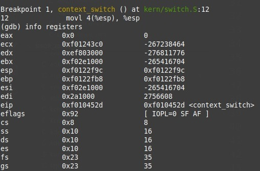
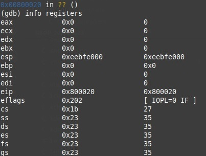

# Scheduler
## Compilacion
Tal como fue mencionado en el README, la compilacion se debe realizar ejecutando:
* para round robin, make -B -e USE_ROUND_ROBIN=true
* para mlfq, make -B -e USE_MLFQ=true
Adicionalmente se puede agregar al final el comando deseado, como qemu-nox, qemu-nox-gdb, grade, etc.

## Context Switch
Se realizaron capturas de pantallas de los registros antes y despues del context switch, con el fin de observar los registros que cambiaban.

Antes del context switch:

Vemos que nos encontramos en el ring 0, pues el cs tiene guardado 00000100, y los dos ultimos bytes son los que denotan el ring en que nos encontramos. Vemos que el eip se encuentra en una direccion bastante alta, al igual que el stack pointer, y que el ss (stack segment), ds (data segment) y el es apuntan al mismo segmento, mientras que el fs y gs apuntan a otros.

Luego del context switch:

Vemos que nos encontramos en el ring 3, pues el cs tiene guardado 00011011, y los dos ultimos bytes que son el ring equivalen a un 3. Vemos que el eip se encuentra en una posicion mucho menor ahora, y el stack pointer tambien disminuyo, aunque no tanto. Vemos que ahora el ss y el ds apuntan al mismo segmento que todos los otros de estos registros, y son distintos a los ss y ds de antes, lo cual tiene sentido, pues no deberia compartir stack ni codigo con el kernel.

## Decisiones de diseno
El scheduler que llevamos a cabo es un scheduler con prioridades del tipo MLFQ, aunque con algunos cambios respecto de la version del libro Operating Systems: Three Easy Pieces. 

Para la implementacion de este, debimos agregar a la estructura del environment diversas variables. Se agregaron:
* size_t env_queue, en donde se guarda el numero de cola en que se encuentra el environment. Este es tambien equivalente a la prioridad del environment. Es necesario a la hora de buscar el siguiente proceso a correr.
* struct Env *next_in_q, en donde se guarda un puntero al siguiente proceso en la cola, es decir, el que debera correr si se encuentra en condiciones. Esto hace posible la idea de la cola. 
* int runtime, en donde se guarda la cantidad de tiempo que lleva un proceso corriendo en la cola en la que se encuentra.

En la estructura queue contamos con dos campos, first y last. La existencia de ambos se debe a un intento por minimizar la complejidad de las operaciones de insercion y eliminacion. Se debe tener en cuenta igualmente que el siguiente del ultimo es el primero, es decir, se tiene una cola circular, para realizar la busqueda mas sencillamente, sin necesidad de dos fors separados.

Se modifico respecto de la implementacion original, la idea de los time slices variables entre las distintas colas. Originalmente, mientras menor es la prioridad de la cola, mas dura el timeslice, ya que los procesos de menor prioridad requieren mas tiempo de CPU. Sin embargo, no queriamos que los procesos se demoren mucho por estar corriendo uno de una cola, ademas de que si, por ejemplo, por 4 timeslices (originales) no habia ningun proceso en la cola de mas arriba, ese tiempo fuese asignado a un unico proceso en vez de repartirlo entre multiples, manteniendo los timeslices originales. Lo que decidimos hacer es permitir que el tiempo maximo de corrida en una cola fuese mas extenso, pero repartido en trozos del mismo tamano en todas, lo cual permitia tener un scheduler periodico. El tiempo maximo de corrida en una cola se lo tomo como 3*(cantidad de colas - numero de cola del proceso); como la cola mas prioritaria es la de mayor numero, esta cuenta da valores mas grandes a medida que se cuenta con procesos menos privilegiados.

Una vez que transcurre un tiempo S de 50*Time slice, entonces las prioridades se reinician. La eleccion se baso en prueba y error en las corridas hasta que logramos optimizar este tiempo. Consideramos que fue una decision dificil, ya que si este es muy alto entonces los procesos de mas abajo no corren, pero si es muy pequeno es poco optimo, ya que constantemente se esta subiendo de cola a los procesos, y los que no gastan muchos recursos se demoran mucho en terminar de correr.

Cuando se crea un nuevo proceso con fork decidimos asignarle a este la prioridad mas alta. 

## Stats
Definimos una estructura para guardar datos sobre las estadisticas del scheduler, y se va actualizando a lo largo
del programa. Consiste de:

* int total_runtime: el tiempo transcurrido desde que se empezaron a correr los procesos.
* int sched_calls: cantidad de veces que fue llamado el scheduler.
* int amount_boosts: cantidad de veces en que los procesos fueron reubicados en la cola de mayor prioridad, cuando se usa MLFQ.
* struct env_run envs_runs[4096]: un vector de env_runs, una estructura que contiene informacion sobre la corridas de un proceso. Cada env_run especifica cual proceso se corrio guardando su env_id y si estamos usando el modelo MLFQ tambien se guarda con que prioridad corrio. El vector forma el historial de corridas general. Cuando se llega al tope de 4096, se deja de guardar en el vector.
* int dead_environments: cantidad de procesos que terminaron de correr. Cuando concluye el programa 
equivale a la cantidad total de procesos inicializados.
* struct env_turnaround env_turnaround[NENV]: un vector de env_turnaround donde se guarda el turnaround time de cada proceso, identificandolo con su env_id. Esto se puede hacer gracias a la existencia del total_runtime, y el hecho de que a cada proceso al crearse, se le almacena su tiempo de llegada.

Todas estas estadisticas se imprimen en sched_halt, previo a que se ingrese al modo monitor.

## Syscals
Creamos tres syscalls propias del mlfq, pero que pueden ser accedidas al estar corriendo en round robin, pero no tendran sentido:
* sys_check_priority: esta syscall es un getter, y devuelve la prioridad del environment en ejecucion.
* sys_reduce_priority: esta syscall reduce la prioridad del proceso que esta corriendo, y se la settea al valor pasado por parametro, siempre y cuando este valor sea menor al de la cola en que estaba el proceso. No permitimos que llegue el id del environment al que bajarle la prioridad ya que no parece justo que un proceso se pueda bajar su propia prioridad.
* sys_set_priority: esta syscall permite que un proceso aumente la prioridad del hijo cuyo envid recibe por parametro, setteando esta a un valor pasado por parametro. Se realizan los chequeos pertinentes para verificar que quien lo setteo es efectivamente el padre, y que el valor al que se esta setteando la prioridad es mayor que el que ya tenia. 

Las decisiones tomadas respecto de las tres syscalls se deben a temas de seguridad.

## Pruebas

Creamos la prueba childboost con el fin de mostrar lo que sucede con los procesos hijos y el funcionamiento de las llamadas al sistema creadas por nosotros. En esta se inicia con un unico proceso (padre), que gasta CPU hasta reducir su prioridad a 2. Una vez hecho esto, se hace un fork, creando asi un proceso hijo que se inicializa con prioridad 4. Como el padre no habia finalizado su timeslice asignado, o en caso de que esto haya sucedido, se llama al scheduler. Alli, se pone al hijo en un bucle para desperdiciar CPU y reducir su prioridad rapidamente. Una vez que el hijo hizo las corridas necesarias para reducir su prioridad, el scheduler lo baja de prioridad y pone al padre a correr, pues estaba primero en la cola de prioridad 2, pero este proceso sigue en el bucle. El padre ahora mediante la syscall set priority setea la prioridad del hijo en 4, la mas alta nuevamente, por lo que el hijo continua en el bucle hasta volver a tener prioridad nuevamente, donde finalmente termina de correr.

Se corre con make -B -e USE_MLFQ=true run-childboost.

Creamos la prueba reducepriority con el fin de mostrar como un proceso puede reducir su propia prioridad, y todo el resto de los procesos correran antes que este. En este caso, usamos la idea del forktree de las pruebas de la catedra pero creando una unica rama. La idea de este es mostrar que todos los procesos correran el final antes que el padre, ya que los hijos se crean con la mayor prioridad, y el padre tiene una menor que esta.

Se corre con make -B -e USE_MLFQ=true run-reducepriority.

Creamos la prueba timeboost para mostrar que tras una cierta cantidad de corridas, las prioridades se resetean y que ademas, a medida que nos encontramos en una cola de prioridad mas baja la cantidad de corridas hasta reducirla son cada vez mayores. Usamos reduce_priority para setear la prioridad de un proceso en 3/4 y en el otro 2/4 (van de 0 a 4). Observamos que se corre el proceso de prioridad 3 hasta que baja a 2 y luego corren ambos en round robin. El programa consta de un bucle que simplemente desperdicia CPU, y del que los procesos salen una vez que su prioridad es 4. Dado que las bajamos a ambas, el programa finalizara cuando se realiza el boost, es decir, cuando se llega nuevamente a la prioridad 4. Para este programa es muy util ver el historial de corridas.

Se corre con make -B -e USE_MLFQ=true run-timeboost.
